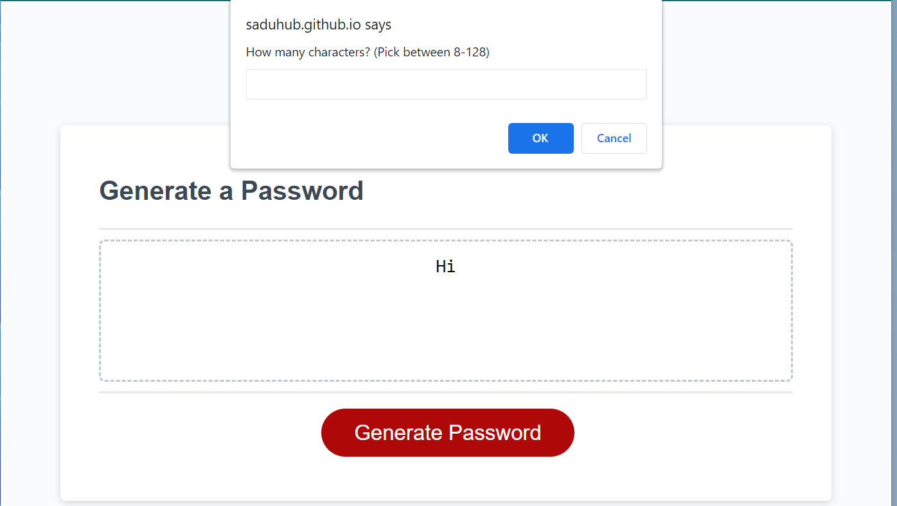
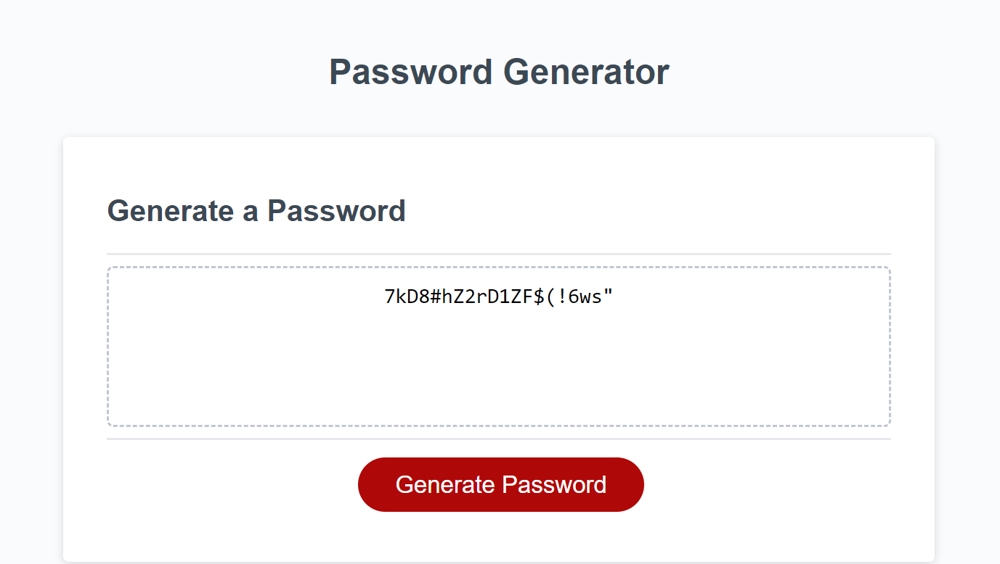

# Password Generator

## Description

The motivation behind this project was to solidify my knowledge of Javascript. I was to build a password generator algorithm from scratch using my knowledge of Javascript. Additionaly, this challenge introduced me to concepts regarding DOM manipulation. I also learned about pseudocode and the importance of writting out what code does before coding. This way, I can understand the overall algorithm structure. Learning about scope and window methods was also crucial for completing this project. 

Link to deployed application [here](https://saduhub.github.io/Password_Generator/)

## Installation

N/A

## Usage

N/A

## Credits

N/A

## License

Please refer to the LICENSE in the repo.