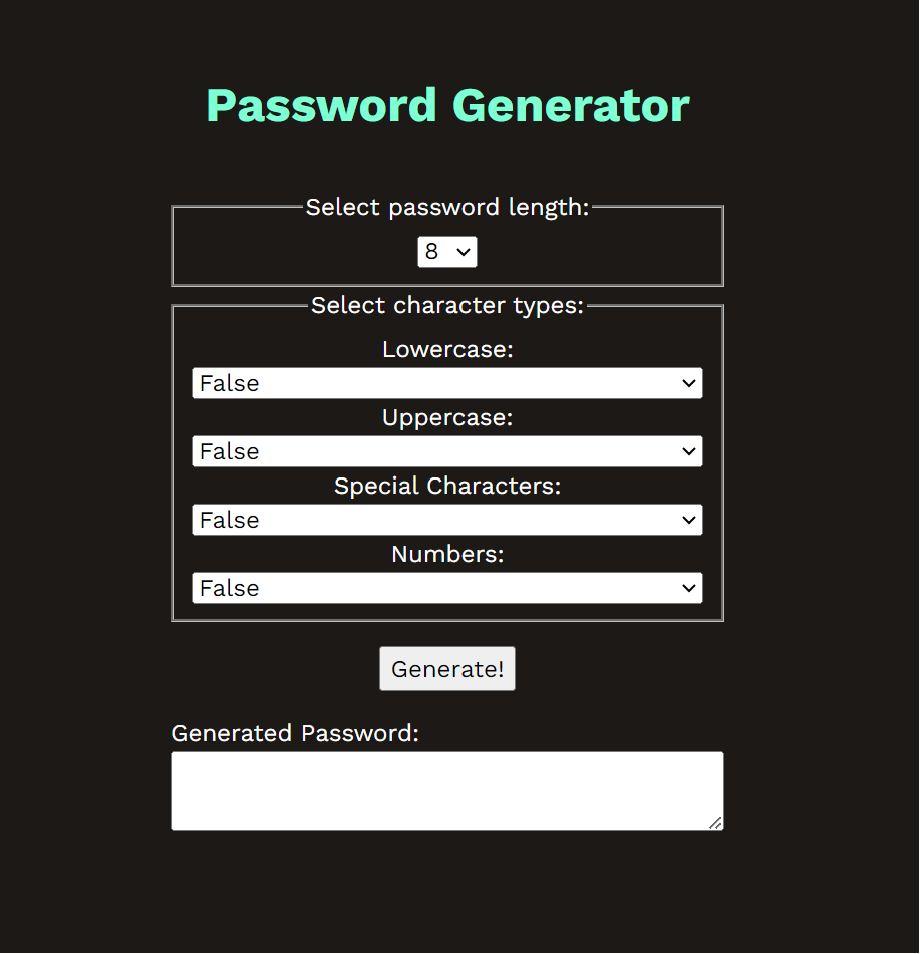

# Password Generator - Typescript

## Description

This project is a password generator that makes use of TypeScript. The motivation behind building this project was to demonstrate proficiency in working with TypeScript. By creating this password generator, I aimed to showcase my skills in designing and implementing an application that offers the ability to generate a new password based on several parameters.

Throughout the development of this project, I gained valuable insights into the following areas:
  
- **TypeScript and Type-Safe Coding**: Using TypeScript has increased my understanding of statically typed languages in the JavaScript ecosystem. I have become familiar with type annotations, interfaces, type inference, function type annotations, and tsconfig.json to ensure type-safety throughout my applications. By making use of TypeScript's compiler and advanced type-checking features, I've been able to catch potential bugs early and streamline the refactoring process. This approach to coding has made my applications more maintainable and helped cultivate the habit of writing self-documenting and predictable code.

Link to deployed application [here](https://saduhub.github.io/Password_Generator/)

## Table of Contents

- [Password Generator - Typescript](#password-generator---typescript)
  - [Description](#description)
  - [Table of Contents](#table-of-contents)
  - [Installation](#installation)
  - [Usage](#usage)
  - [Contributors](#contributors)
  - [License](#license)

## Installation

To set up the project locally, follow these steps:

1. Clone the repository (HTTPS): `git clone https://github.com/saduhub/Password_Generator.git`
2. Navigate to the project directory: `cd Password_Generator`
3. Install dependencies: `npm run install`
4. Open index.html file using Live Server: `Right click + Open with Live Server`

## Usage

1. Access the password generator on [Github Pages](https://saduhub.github.io/Password_Generator/).
2. Select the number and types of characters.
3. Enjoy a password generator!

## Contributors

This project was developed by [Saduhub](https://github.com/saduhub).

## License

This project is licensed under the [MIT License](https://opensource.org/license/mit/).

This web application is intended strictly for educational and illustrative purposes. The creators and contributors of this project cannot assume liability for any potential consequences resulting from the use of this web application.
Users and deployers of this application bear the full responsibility of implementing adequate security measures and ensuring the secure handling of sensitive data. Please exercise caution when interacting with this or any other web application involving personal or sensitive data. 